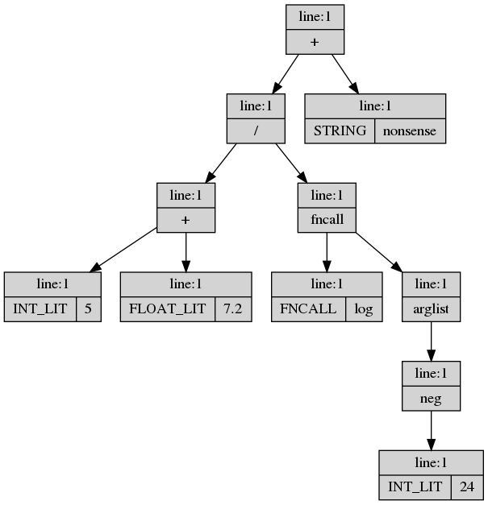

Lemon Py
--------

This project wraps the Lemon parser generator. If you aren't sure what
a parser generator is, this is maybe not something you need.

lemon-py provides functions that compile a EBNF grammar and a lexer
definition into a standalone native module for Python 3.x or (with a
little work) C++ . The resulting lexer+parser is implemented entirely
in native code, and has no external dependencies (including on this
project or any Python code) and is suitable for use as a submodule in
other projects.  You can just `import` it and run `parse()`.

lemon-py parsers output a uniformly-typed parse tree. All productions
are identified by a string name, and all terminal values are returned
by string as well--no type conversions are applied inside of the
parser module. The returned parse tree has a convenient interface in
both Python and modern C++, with the details of Lemon's proud legacy
hidden away safely. One standout feature, available in both Python and
C++, is (dependency-free) GraphViz `dot` output for graphical
visualization of parse trees--essential for language development.

lemon-py extends the Lemon parser generator with a built-in,
configurable lexer. The lexer handles commonly-encountered token types
such as constant/literal character strings, case-insensitive regular
expressions with captured value, and strings with user-defined
delimiter and escape characters. The lexer also supports user-defined
"skip" patterns for omitting lexically-irrelevant characters. The
lexer is not especially performant, but is implemented in an
easily-extensible manner, allowing for easy expansion and
customization.

lemon-py grammar files are essentially just regular [lemon grammar
files](lemon/lemon.html) but include an extension to support automatic
lexer generation. 


A lexer and grammar definition for lemon py.
```
/*
@pymod expr_parse

@lexdef
!whitespace : \s
!comment : //.*\n

' ' \   := CHAR
' " \ ! := STRING

ADD := +
SUB := -
MUL := *
DIV := /
L_PAREN := (
R_PAREN := )
COMMA := ,

FLOAT_LIT : [0-9]+\.[0-9]+
INT_LIT : [0-9]+
FNCALL : ([_a-z][_a-z0-9]*)\s*\(
IDENT : [_a-z][_a-z0-9]*
@endlex
*/

// token association, and implicit (ascending) priority
%left COMMA FNCALL.
%left ADD SUB.
%left MUL DIV.

toplevel ::= expr(c1).                            { p->push_root(c1); }

expr(e) ::= expr(c1) ADD(o) expr(c2).             { e = p("+", {c1, c2}, o.line); }
expr(e) ::= expr(c1) SUB(o) expr(c2).             { e = p("-", {c1, c2}, o.line); }
expr(e) ::= expr(c1) MUL(o) expr(c2).             { e = p("*", {c1, c2}, o.line); }
expr(e) ::= expr(c1) DIV(o) expr(c2).             { e = p("/", {c1, c2}, o.line); }
expr(e) ::= SUB expr(c1). [MUL]                   { e = p("neg", {c1}, c1->line); }
expr(e) ::= L_PAREN expr(e1) R_PAREN.             { e = e1; }

expr(e) ::= varref(e1).                           { e = e1; }
varref(e) ::= IDENT(lit).                         { e = p("varref", {p(lit)}, lit.line); }

expr(e) ::= fncall(e1).                           { e = e1; }
fncall(e) ::= FNCALL(lit1) arg_list(c2) R_PAREN.  { e = p("fncall", {p(lit1), c2}, lit1.line); }

arg_list(L) ::= .                                 { L = p("arglist"); }
arg_list(L) ::= expr(c1).                         { L = p("arglist", {c1}, c1->line); }
arg_list(L) ::= arg_list(L1) COMMA expr(e).       { L1->pb(e); L = L1; }

expr(e) ::= FLOAT_LIT(lit).                       { e = p(lit); }
expr(e) ::= INT_LIT(lit).                         { e = p(lit); }

expr(e) ::= CHAR(lit).                            { e = p(lit); }
expr(e) ::= STRING(lit).                          { e = p(lit); }
```

Which is compiled and installed like: `$ lempy_build expressions.lemon`.

Which can be used from Python like:
```
import expr_parse
import json
expression = expr_parse.parse('(5 + 7.2) / log(-24) + "nonsense"')
print(json.dumps(expression.as_dict(), indent=1))
with open('out.dot', 'w') as f:
     f.write(expr_parse.dotify(expression))
```

Ignoring the very verbose JSON output, after rendering with `$ dot
-Tpng -oexample_tree.png out.dot`, this yields:



Prereqs
-------

While the generated parser modules have no dependencies, this project
_itself_ has several.

Only unix-like operating systems are supported right now.

Python 3.6+ required.

lemon-py depends on `g++` supporting at least c++17. It also depends
on the `pybind11` PyPi module (not just headers installed to system
include paths), and probably the `python3-dev` system package to get
the `Python.h` header. Only standard C/C++ headers are used otherwise.

Start by building `lemon` with `make` in the root directory. If you
don't do this, later commands will fail in mysterious and bizarre
ways.

You can install via `setup.py` and `pip3`, or just add `src` to your
`PYTHONPATH`. [Note: That first part is currently lies. There's no
setup. Hack your `PYTHONPATH`.]


Invocation
----------

The following modules can be invoked from the command line using
`python3 -m MOD ARGS...`. All of these modules support a `--help`
argument that will give usage information on the particular command
and its options.

* `lemon_py.BuildGrammar` - build a grammar file containing lemon-py
  lexer definitions and Lemon grammar into a loadable python module,
  and (optionally/usually) install that to the current user's local
  python packages.

* `lemon_py.Driver` - load a lemon-py parser module, parse a file into
  a tree, and perform basic operations like graphical tree
  visualization and JSON export.

Build a grammar into a loadable module and place it in your personal
site-packages path using the following command:

```
# long form
python3 -m lemon_py.BuildGrammar path/to/grammar.lemon

# shorter version (if `bin/` is in path)
lempy_build path/to/grammar.lemon
```

You can then load it in Python with `import MOD_NAME`, where
`MOD_NAME` is whatever you configured with the `@pymod` directive
inside the grammar file.

You can also use `python3 -m lemon_py.Driver MOD_NAME path/to/input.txt`
or `lempy MOD_NAME path/to/input.txt` to parse a
file and run some basic operations on the resulting parse tree. One
such option is `--vis`, which will run graphviz `dot` and ImageMagick
`display` to visualize the parse tree (assuming those tools are
installed). Another is `--json`, which will dump a JSON copy of the
parse tree to the console.

Convenience scripts for `BuildGrammar` and `Driver` are located in
`bin/` and are called `lempy_build` and `lempy` respectively. Assuming
the modules above are on your `PYTHONPATH` somehow, these scripts only
need to be anywhere on your regular `PATH`.

_____________________________________________________________________


Parser Module API
-----------------

Once you've built your language module, you can simply `import` it by
the name you gave it with the `@pymod` directive.

The module exports several free functions:

* `parse(input: str) -> ParseNode` - parses a string into a parse
  tree, returning the root node. Lex and parse errors generate
  `RuntimeError` with text describing the error and location.

Note that a common mistake when starting a new language is forgetting
to define the lexer in its entirety, covering all legal characters
that _might_ occur in a valid parse input all the way up to the end of
input--potentially using skips to pass over irrelevant characters like
whitespace and newlines. If your lexer is incomplete or incorrect, you
will always get lexer errors from `parse()`. Use `lempy_build
--terminals` to export a skeleton `@lexdef` block to make sure you
cover all terminals; this includes a default whitespace skip.

* `dotify(input: ParseNode) -> str` - returns a string representing
  the parse tree and its values, suitable for rendering using GraphViz
  `dot`. Note that this function does not call, link to, or depend on
  GraphViz or any other external library, doing all its processing as
  raw text. GraphViz is only needed to interpret the output.

The parse tree is represented by an extension class named
`ParseNode`. This class is implemented separately by each generated
parser module, and the functions above are only meant to work on
`ParseNode` instances created by `parse()` in the same module.

Overall, this object is not a good candidate for first-class data type
in a Python application: the object is a "value", more similar to a
single huge JSON document than a Pythonic expectation of references to
subobjects. Transforms such as reordering children, pivoting subtrees,
and other such operations are unsupported and undefined.

For non-trivial usage, it's suggested that the Python application
manipulate the parse tree only temporaily, usually to construct an
application-specific representation of the parsed structures. The
parse tree can then either be discarded, or maintained in memory to
aid in diagnostics. Keep in mind that parse trees may be enormous,
several times bigger than an application-specific abstract syntax tree
for the same structures.

`ParseNode` instances have the following read-only members:

* `.production: str` - the user-defined production name, or `None` if
  the node represents a terminal/token.

* `.type: str` - the Lemon-defined token name, or `None` if the node
  represents a production.

* `.value: str` - the lexer-extracted string value for a value token. For
  literal tokens, the original lexer input string. `None` for
  productions.

* `.c: Sequence[ParseNode]` - the children of this node. In a typical,
  well-formed parse tree, all leaves are terminals and all internal
  nodes are productions. Nothing in Lemon or lemon-py enforces this,
  however, and grammar actions are free to add children to nodes
  representing terminals.

* `.line: int` - the line number assigned to this node from the
  user-defined grammar actions. `-1` if undefined/unknown. Only
  terminals are automatically annotated by the lexer with the
  approximate line number, so parse nodes created directly from
  `Token` values will automatically have a line number attached. Parse
  nodes created with a production name must have their line number set
  within the grammar action; this does not happen automatically.

* `.id: int` - an identifier for this node guaranteed to be unique
  within a single tree. These are assigned in pre-order.

`ParseNode` also has the following mutable members:

* `.attr: dict` - not used by lemon-py, this is meant for applications
  to attach additional data to the parse tree. It may be used as you
  see fit; but it's generally recommended to use the parse tree only
  briefly to build a higher-level syntax tree.  `.attr` is geared more
  toward the temporary data necessary for those transforms than for
  rigorous in-tree analysis.

`ParseNode` has the following methods:

* `.as_dict() -> dict` - make a deep copy of this node and all
  children, recursively, returning the results as a regular Python
  `dict`. This is very useful for trivially interoperating with
  existing Python code designed for tree-of-`dict` data
  structures. This can enable a JSON parse-tree export with 1 line of
  code (see `Driver.py`).

`ParseNode` supports the Python container interface over its children,
including iteration and subscripting. `mynode[2]` will return the 3rd
child of `mynode`. `for c in mynode` will iterate the children of
`mynode`.

`ParseNode` equality check (via `==`) is by-value and deep. Equality
checks that production, type, and value are equal (by string); and
that this is true for all children, recursively. This seems the most
useful check for equality within the value-tree framework, where we
typically want to know if the parse nodes express
syntactically-equivalent (sub)expressions.


Module Definition
-----------------

Lemon-py grammar definitions must include a `@pymod MODULE_NAME`
directive somewhere indicating the Python `MODULE_NAME` to
generate. This text is not removed before processing, and so should be
inside a comment. Example:

* `//@pymod parse_my_lang`


Lexer Definitions
-----------------

An integrated lexer is one of lemon-py's labor-saving
features. Without it, you would need to write a lexer for each target
language. For the purposes of this (and only this) section, words like
"returned" and "value" should be taken in the context of the internal
lexer->parser interface used inside of grammar production
rules.

Lexer definitions appear inside a comment block as a run of
`token : pattern` definitions, one per line, starting on the line
following `@lexdef` and continuing until `@endlex`. Note that these
definition lines are _not_ removed from the grammar input to `lemon`,
and so should always be inside a comment block. It's an error to
define multiple `@lexdef` blocks, and only the first one will be used.

Use `lemon_py.BuildGrammar --terminals` to output a skeleton lexer
definition. This is derived from the header file declaring token codes
output by `lemon`. You will want to replace the defined literal values
with your own language's token literals, adjust terminator values and
skips, and define value-type tokens as described below.

The lexer itself is relatively basic. It handles two classes of tokens
("literal" and "value"), plus user-defined skip patterns and canonical
string support. Declarations of different classes may be mixed in the
`@lexdef` block, and the ordering rules discussed below apply only to
the relative definition of different tokens of the _same class_.

"literal" tokens are defined by a fixed string of
case-sensitive/exactly-matched characters, and are stored/matched with
a basic prefix tree. Literals are matched greedily, with the longest
matching sequence having priority. Thus the order in which you define
overlapping literals is largely irrelevant (although definition order
will influence search order between disjoint literals). Literal tokens
are returned by Lemon-defined code number, with a value equal to the
original lexer configuration string.

NOTE: leading/trailing whitespace is _not_ preserved on the right side
of the definition, although internal whitespace is preserved. The
definition string is subjected to `str.strip()` prior to codegen.

* Literal syntax: `TOKEN := literal_string`.

Literal tokens have a higher priority than value tokens below, and so
may erroneously consume the prefix of a value token. For instance,
defining a literal matching `else` would consume the first part of a
variable named `elsewhere`, generating a mis-parse or parse
error. Reprioritizing values higher than literals would result in
`else` lexing as an identifier in the above example.

To solve this problem, literals may optionally be declared with a
terminator pattern. The pattern is a regular expression which _must
match_ the input after the literal string in order for the literal to
match. The terminator characters themselves are _not consumed_ as
input, but are only used as a lookahead check to aid in matching the
literal.

NOTE: The brain-dead parser for the lexer definitions splits the input
on `:` surrounded by whitespace in order to find the terminator
expression. This means you probably cannot define a terminator
expression for a literal internally containing a `:` surrounded by
spaces.

* Literal syntax with terminator: `TOKEN := literal_string : regular_expression`
 
"value" tokens are defined by a regular expression, and are returned
with both a token code and a text value. A single sub-match may be
specified, and if present will be used to extract the sub-match as the
token's value. No type conversions are applied, all values are
returned as strings.

Value token patterns are checked in the same order they're specified
in the `@lexdef` block. Typically this means you should specify
longer, more specific patterns first; and then shorter, or more
generic patterns after. For instance, to keep your `INT_LITERAL` from
always eating the first part of a `FLOAT_LITERAL` (resulting in
subsequent lex or parse errors), define the floating-point literal
(with mandatory decimal point) _before_ the integer literal.

NOTE: All regular expressions are currently matched *without* case
sensitivity.

* Value syntax: `TOKEN : regular_expression`.
 
Skip patterns are simply regexes that are used to skip whitespace,
comments, or other lexically and syntactically-irrelevant
content. Skip patterns are applied before every attempt at token
extraction. The `reminder_name` below is not used internally, and can
simply be used to label the skip pattern for human comprehension.

NOTE: All regular expressions are currently matched *without* case
sensitivity.

* Skip syntax: `!reminder_name : regular_expression`.

Strings are handled by a set of internal functions that provide for
escaping the delimeter (and escaping the escape by doubling it). The
delimeter character, escape character, and token code are
configurable. A string lexer definition is declared by starting the
line with the `'` (single-quote) character. The next character is the
string delimeter, and the subsequent character is the escape
character.

Finally, the special character `!` may appear as a third character,
indicating that the string lexer should not treat reaching end of line
before the end delimeter as an error. If the `!` is not specified, the
lexer will automatically consider it an error for a string to cross a
newline boundary--this is often desirable as it makes locating
target-language syntax errors much easier.

All whitespace in the delimiter definition is ignored, including
between the delimeter and escape characters.

Strings delimited by the given character are assigned the token code
appearing to the right of the `:=` on the line.

String values returned by the lexer _do not_ include the surrounding
delimters.

Notes: Due to lazy lexdef parsing, you can't define a string with a
colon as a delimiter or escape.

String syntax examples:

* `' "\ := STR_TOK` - assign double-quote delimeted strings to
  `STR_TOK`, and use the backslash as an escape character. (This is
  mostly like normal C-style strings.)

* `' @;! := DOC` - assign at-sign delimeted strings to `DOC`, use the
  semi-colon as an escape character, and freely pass over the newline
  character. Something like:

```
@look ;@ me 
over;;here@
```

Token classes are tested in the following order:

0. (skips)
1. EOF
2. strings
3. literals
4. values

Skips are applied repeatedly, before checking for the next lexical
token, until no skip consumes input. EOF is automatically emitted when
the lexer reaches end of input. If the lexer has not reached the end
of input, and no new token can be matched,

An example `@lexdef` can be found in the example at the top of this
readme.


Parser Definition
-----------------

The original Lemon parser-definition language is unchanged. Instead, a
standard set of headers is included providing definitions available
for use inside the parser actions. These definitions make it
relatively trivial to generate generic parse trees to represent
anything Lemon can parse.

A variable `_parser_impl::Parser *p` is available in every parser
action. This forms the handle to most of the interface. Call the
functions below like `p->mn(...)`.

_You may ignore memory management for nodes created using the `p->`
interfaces_. All of these nodes are tracked by the internal `Parser`
state, and any that go astray will be automatically freed when the
parser completes or fails. This is one of the motivating features for
this project, so please abuse it merily and report leaking `ParseNode`
on github.

You're on your own to manage memory for your own objects you create in
grammar actions. lemon-py defines a `%default_destructor` for the
Lemon grammar, but due to the tracked node pointers discussed above,
these are ultimately unnecessary for normal-sized inputs, serving only
to reduce interim memory usage and not to avoid memory leaks.  As a
result, you may use the occasional per-rule `%destructor` if you wish.

Available functions are as follows:

* `ParseNode* p->push_root(ParseNode *root)` - sets the overall result
  for the Parser parse operation. If you don't `push_root` some node
  (usually in the top level rule), no results will be generated from
  parsing. Returns the newly-set root node.

* `ParseNode* p->mn(ParseValue const& value, ChildrenPack const& children = {}, int64_t line = -1)` -
  stands for `make_node`, and creates a new ParseNode. You can pass in
  either a `Token` or a string production name for the first value; an
  initializer list of `ParseNode*` children for the second argument;
  and a line number to associate with the node. If you pass a Token
  for the first argument, the line is automatically filled in for you;
  for non-terminal productions, you'll need to assign the node its
  line manually. This is the workhorse of the API. Returns the
  newly-created node.

* `p->mn` is _so ubiquitous_ that the `p` object itself is callable as an
  alias for `p->mn()`. Literally just call `p(value, children, line)`, 
  same optional arguments as the "regular" method. C++ magic, yo.

* `ParseNode* node->pb(ParseNode *child)` - stands for `push_back` and
  adds a child to right of a node's existing children. Note that this
  function is defined on the `ParseNode`, not on the `Parser`, and so
  is called with some Lemon-aliased or newly-constructed node and not
  with `p->`. Returns the _containing_ (not child) node, easing
  chaining for list construction.

* `ParseNode* node->pf(ParseNode *child)` - `push_front`, the opposite
  of `push_back`, this adds nodes to the left of the existing
  children. In general, needing to use this is an indication that
  you've got a bunch of right-recursion in your grammar design.

* `ParseNode* node->l(int)` - also defined on the node, sets the line
  number. The line number of an existing node is stored in the `.line`
  field.

Tokens include `.type` and `.line` fields, and you can retrieve
strings representing the name and value with `.name()` and `.value()`
respectively. However, the internal fields of the token are usually
superfluous within a grammar action. Typically, you can just pass the
whole `Token` object (identified by Lemon metavariable) as the sole
argument to `p->mn()` to create a terminal node.

Check out the examples for a better idea of how to use this
stuff. It's not especially intuitive if you've never used a parser
generator before, and teaching you to use one is beyond the scope of
this readme. I suggest the Dragon Book (you might know the one), or
any of the various tutorials on using Bison/Yacc. The concepts are
highly transferable.

The `test_grammars/parasol` directory contains a draft of the grammar
for a fairly "complete" programming language, including a non-trivial
expression tree. This goes well beyond the designed-to-parse toy
examples provided with parser generators. One real-world "wrinkle" to
note is the use of the lexer to detect function calls and "scope refs"
instead of the parser (by id with trailing `(` and `[` respectively),
thereby avoiding ambiguities around function argument lists inside
expression trees.


_____________________________________________________________________


How Does It Work?
-----------------

Most of the moving parts are in `ParserImpl.cpp`, which implements the
lexer, parse tree, and Python module interface. A small amount of code
(`void _init_lexer(){...}`) is generated to configure the lexer from
the input file, but this is merely inserted into the generated Lemon
input file itself.

A number of seemingly-weird decisions in the C++ widgetry are the
result of adapting to the Lemon grammar action
environment. Critically, Lemon puts the token type and the type of
every production rule into a single giant C `union`. This means they
must be trivial types, which eliminates the direct use of smart
pointers or containers to manage memory within grammar
actions. Instead, the lemon-py `_parser_impl::Parser` object
internally allocates nodes into `unique_ptr`s and returns a raw
pointer to the same object for use only within the Lemon grammar
actions. Value tokens are treated similarly, with an integer
terminal-code value member, but pointer and index into a table instead
of an internal `std::string`. When the `Parser` is destructed, all of
the node and string memory is reclaimed and all
`_parser_impl::ParseNode` and `Token` objects created by that `Parser`
become invalid.

Before returning the parse tree to the high-level interface, and
before it is destroyed (of course), the entire pointer-based internal
parse tree is dereferenced and copied into a simplified, value-typed
representation (`parser::ParseNode`). The intermediate, indirect tree
is deallocated and the returned tree is free of any complicated
ownership semantics.

The python aspect of lemon-py reads the input grammar file, builds the
lexer configuration, and outputs a Lemon grammar file that inlines the
lexer configuration and includes the `ParserImpl.cpp` file to
implement the lexer and parser environment. The file is placed in a
temporary working directory and `lemon` is invoked on it to generate
the final source code for the parser module. The module is then built
with standard pybind11 settings, using `g++`. Finally, it is copied
into the current `python3` interpreter's personal site-packages for
the current user.


Limitations
-----------

The biggest limitation is probably that the parsers generated by
lemon-py operate on in-memory strings, with no support for incremental
reads from irreversible streams. This vastly eases implementation of
the lexer, which can look ahead an arbitrary number of characters
without side effect as it tests different lexical matches. 

The `pybind11` wrapper is also liable to _copy_ the input string from
Python into a `std::string` before passing it to the native `parse()`
function. From a performance perspective, this is effectively
invisible compared to Python performance, but the redundant memory
usage does mean that lemon-py parsers are probably not suitable for
parsing really huge inputs that challenge system memory
limits.

Enhancing lemon-py to operate on irreversible iterators would require
substantial modification to the lexer, with implications on the ease
of defining a new lexer. I don't currently need such a thing, and I
don't have the energy to implement it just for completeness' sake.

The same goes for the output, which is a value-typed tree full of
highly-redundant strings. For very large inputs, and especially for
deeply-nested non-terminal productions (complicated grammars), the
parse tree itself can be very large. In practice, for most industry
DSLs, hobby languages, and research languages, this is not a real
limitation. Inputs are rarely 1 MiB of text, let alone the GiB it
would take to challenge most modern computers.

These issues can be alleviated by re-using the proven Lemon grammar
with a custom (buffering) lexer, grammar actions, and/or tree type
when moving from typical usage to large-input usage. The biggest gains
come from rewriting with a high-level AST, built directly in the
grammar actions, which can collapse many intermediate parse nodes into
fewer syntax nodes.

Finally, in the memory hog department, both Lemon and I use recursive
functions all over the place. If you have really recursive grammars or
extremely long lexer literals, you might run into the stack limit on
your machine. I've been programming for 25+ years now have have _only_
run out of stack when there's been an error causing infinite
recursion.

lemon-py is also probably unsuitable for parsing binary or unicode
streams. The underlying Lemon parsers are fully capable of working
with anything you can tokenize, but the lemon-py lexer implementation
is basically character-oriented and currently limited to 8-bit ASCII
text. Support for unicode could be accomplished with relatively
straightforward enhancements to the lexer, but I don't know about
`std::regex` on binary strings.


Motivation and Alternatives
---------------------------

I want to play with definitions and implementations of programming
languages. It's hard enough to invent an unambiguous, expressive
syntax without then needing to reconfigure it to avoid parser
generator limitations. Since language definitions are often deeply
recursive, you can spend quite a lot of work before you discover some
parse ambiguity that necessitates a restructuring of a large part of
your definition. This especially crops up in the deeply-recursive
aspects of programming languages like expression syntaxes (`5 + max(2,
some_func() - 0.2) / 6.2`), at which point controlling operator and
production precedence becomes critical.

Literally every time I have tried an LL or PEG parser generator on any
sufficiently-complicated grammar, I have run into some ridiculous
precedence or ambiguity issue that has to be solved by rewriting some
big chunk of my expression tree into something substantially less
maintainable. It becomes complicated to explore "what if?" questions
about syntax because adding another branch to a rule often requires
rewriting many other rules to take the new union production. Perhaps
smarter language authors have no trouble with this, but I do.

Lemon accepts relatively "normal" EBNF grammars, has an outstanding
grammar action system, and critically implements a LALR(1)
parser. Furthermore, it implements a full suite of associativity and
precedence rules for terminals. Finally, unlike `bison`/`Yacc` output,
the Lemon parser code implements consistent memory reclamation and is
safe by default for multiple instantiation with no state shared
between instances. I also prefer Lemon's overall syntax to `bison`. In
Lemon, I can simply write down the grammar for my language and resolve
ambiguities abstractly instead of by coercing the grammar itself.

At the same time, Lemon is a fairly old project (started in the 80's)
and has a relatively naive API. While it's suitable for directly
generating an AST with appropriate types and grammar rules, it works
only with "trivial" C types, provides no default/generic parse tree
data, and it requires an external, proper lexer. As a result, when
working with it in the past, I have been inclined to develop the
target language's custom lexer and AST type framework at the same time
as the parser grammar. Since Lemon works only with raw pointers, this
inclines the AST design toward owning raw pointers, which feels pretty
gross here in 2021.

Likewise, since I'm rarely targeting general-purpose languages where
translation units become enormous, nor am I often targeting machine-
code back ends where bit-twiddling and isomorphic binary
representation are routine, nor do I need blinding performance...
implementing the whole of my compiler in C++ from the very start feels
onerous. I want my favorite parser available from Python, with the
option of using the same grammar in C++ if I'm ready to build a native
compiler.

There exist other LR or LALR parser generators for Python that I know
of:

* [Lark](https://github.com/lark-parser/lark)
* [lrparsing](https://pypi.org/project/lrparsing/)
* [pyleri](https://github.com/transceptor-technology/pyleri)

You may like one of those better. Certainly they have advantages, like
skipping the rather time-consuming C++ compilation stage. The latter
two also build their grammars mostly or entirely from within Python
code, which can make them attractive for certain applications. I do
not like that approach, as I find reading and following the recursion
of different rules much more complicated when cluttered by the Python
syntax on top of the grammar's own definition syntax. You might like
that better than writing C++ grammar actions, though.

Lark is probably the closest in capabilities and design to lemon-py,
in that it is driven by a data file (string) defining the grammar. It
also has a built-in lexer. However, its implementation of LALR(1)+EBNF
does not support operator associativity or precedence, meaning that
despite the algorithm it uses, it functionally has many of the same
shortcomings as typical LL and PEG parser generators.

Of those options, only `pyleri` is capable of outputting a parser
generator in C. I found it only after I started this project, and its
syntax left me undeterred from finishing.


Anticipated Questions
---------------------

Q. Windows support?

A. I have no idea how to easily, automatically compile a Python
extension on Windows. I think we would need to output a VS project,
and that's more than I want to deal with. Especially because I haven't
written code on Windows in years. If you know how to do this, please
submit a PR.


Q. OSX support?

A. Should be easily enough to make that work, but I do not have a
Mac. Please submit a PR or Macbook.


Q. Why C++ instead of C?

A. I like modern C++. I don't really like solving the same problems in
boilerplate C.


Q. Why C++17 instead of C++(`n < 17`)?

A. I like modern C++. I don't really like solving the same problems in
antique C++.


Q. Why C++17 instead of C++(`n > 17`)?

A. System compiler support.


Q. Why hardcode to `g++` instead of configurable compiler?

A. It's good enough for me, and I don't need configurability as my
system Python is built with `gcc`. I did look for a cross-platform
compiler control library, but couldn't find one. Let me know if you
have one. Maybe as part of SCons?


Q. How do I use the native lexer+tree+parser framework independently
of Python?

A. The process is currently a bit ugly and manual. Use the `--debug
--noinstall` options when building the grammar to generate all
intermediate and output files to the current working directory
(instead of a tempdir). You'll need to edit the various includes and
whatnot, but you should be able to untangle it. The public interface
is defined in `ParseNode.hpp` inside the lemon-py directory, where you
can also find `ParserImpl.cpp`.

By default the generated Lemon grammar file _includes the `.cpp` file_
in order to implement the lexer + parser environment. This makes it
easier to build the Python module, but is probably not what you want
for a nice clean C++ build.

`#define LEMON_PY_SUPPRESS_PYTHON` will disable inclusion of
`pybind11` and definition of python-related interfaces. This has some
effects in both the header and implementation file, and you should
probably not attempt to link a C++ program to a parser built as a
Python module.

The C++ header file defines the `parser` namespace, in which you can
find the `ParseNode` implementation as well as `ParseNode
parse_string(std::string const&)` and `std::string dotify(ParseNode
const&)`.


Q. Why doesn't lemon-py automatically write grammar actions?

A. I haven't figure out how to do that without parsing the grammar
definition. And I don't want to do that without a tool like
lemon-py. And I don't want to have a bootstrapping problem.

Although, as I think about it...


